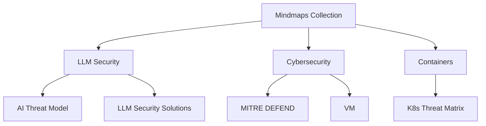

# Mindmaps Collection

This repository contains a collection of mindmaps developed by Shubhendu. The mindmaps cover various topics related to cybersecurity, LLM security, and container security.

## Table of Contents
- [Mindmaps Collection](#mindmaps-collection)
  - [Table of Contents](#table-of-contents)
  - [Project Structure](#project-structure)
  - [Mindmaps](#mindmaps)
    - [LLM Security](#llm-security)
    - [Cybersecurity](#cybersecurity)
    - [Containers](#containers)
  - [Usage](#usage)
  - [Contributing](#contributing)
  - [License](#license)

## Project Structure


**Usage**
1. Clone the repository:
```
git clone https://github.com/sivolko/mindmaps.git
```
2. Open the index.html file in your browser to navigate through the mindmaps.

**Contributing**
Contributions are welcome! Please follow these steps:

1. Fork the repository.
2. Create a new branch (git checkout -b feature-branch).
3. Make your changes.
4. Commit your changes (git commit -am 'Add new feature').
5. Push to the branch (git push origin feature-branch).
6. Open a pull request.

**License**
This project is licensed under the MIT License - see the LICENSE file for details.
